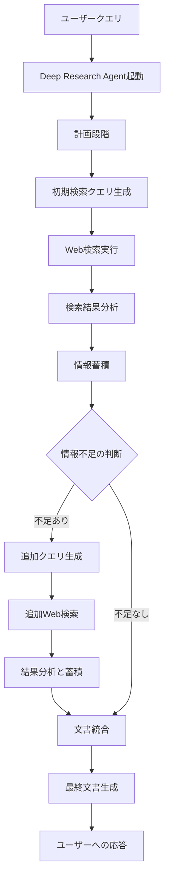
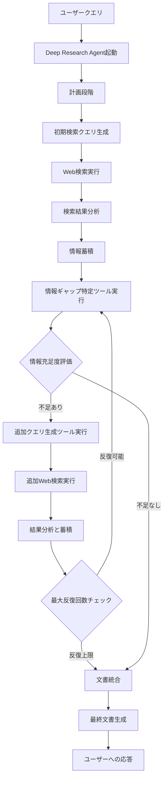

# Deep Research 追加検索フロー詳細

## 現在の実装状況

現在のDeep Research Agentは、追加検索（フォローアップ検索）の機能を**部分的に実装**しています。コードベースを分析した結果、以下のことが分かりました：

1. **クエリ生成ツール**（`query-generator.ts`）には、初期検索とフォローアップ検索の両方のクエリを生成する機能が実装されています。
2. **情報蓄積ツール**（`information-accumulator.ts`）は、検索結果を蓄積し、既存の情報と新しい情報を統合する機能を持っています。
3. しかし、**情報ギャップの特定**と**追加検索の自動実行**のフローが完全には実装されていません。

## 現在の追加検索フロー

現在の実装では、追加検索は以下のフローで行われています：

```
初期検索 → 結果蓄積 → エージェントの判断 → (必要に応じて)追加検索
```

### 詳細フロー図



## 現在の実装の詳細

### 1. クエリ生成ツール（query-generator.ts）

クエリ生成ツールは、初期検索とフォローアップ検索の両方に対応しています：

```typescript
export const queryGenerator = createTool({
  // ...
  execute: async ({ context: { topic, sectionId, sectionName, sectionPurpose, sectionFocus, previousResults, missingInformation } }) => {
    // 初回検索の場合
    if (!previousResults || previousResults.length === 0) {
      const initialQueries = generateInitialQueries(topic, sectionName, sectionFocus);
      // ...
    }
    
    // フォローアップ検索の場合
    const followUpQueries = generateFollowUpQueries(
      topic, 
      sectionName, 
      sectionFocus,
      missingInformation || []
    );
    // ...
  },
});
```

### 2. フォローアップクエリ生成関数

不足情報に基づいて追加検索クエリを生成する機能が実装されています：

```typescript
function generateFollowUpQueries(
  topic: string, 
  sectionName: string, 
  sectionFocus: string[],
  missingInformation: string[]
): string[] {
  // 不足情報ごとのクエリ
  const queries: string[] = [];
  missingInformation.forEach(info => {
    queries.push(`${topic} ${sectionName} ${info}`);
  });
  
  // 特定の組み合わせのクエリも追加
  // ...
  
  return queries;
}
```

### 3. 情報蓄積ツール（information-accumulator.ts）

既存の情報と新しい情報を統合する機能が実装されています：

```typescript
function accumulateInformation(
  sectionId: string,
  sectionName: string,
  searchResults: any[],
  existingInformation: any[]
): any[] {
  // 既存の情報がない場合は、検索結果から新しい情報を作成
  if (existingInformation.length === 0) {
    // ...
  }
  
  // 既存の情報がある場合は、重複を排除して新しい情報を追加
  const newInformation: any[] = [...existingInformation];
  const existingUrls = new Set(existingInformation.map(info => info.source));
  
  searchResults.forEach((result, index) => {
    // 重複するURLがない場合のみ追加
    if (!existingUrls.has(result.url)) {
      // ...
    }
  });
  
  // 関連性でソート
  return newInformation.sort((a, b) => b.relevance - a.relevance);
}
```

## 現在の課題と改善点

現在の実装には以下の課題があります：

1. **情報ギャップ特定ツールの不在**：
   - 専用の「情報ギャップ特定ツール」が実装されていません。
   - 現在は、エージェント自身が情報の不足を判断しています。

2. **追加検索の自動化フローの不完全さ**：
   - 追加検索の実行判断と実行フローが明示的に実装されていません。
   - エージェントの判断に依存しています。

3. **情報不足の定量的評価の欠如**：
   - 情報の充足度を定量的に評価する仕組みがありません。
   - 主観的な判断に依存しています。

## 改善案：完全な追加検索フロー

以下に、理想的な追加検索フローの実装案を示します：

### 改善版フロー図



### 実装すべき追加ツール

1. **情報ギャップ特定ツール**（`gap-identifier.ts`）：
   ```typescript
   export const gapIdentifier = createTool({
     id: "Gap Identifier",
     inputSchema: z.object({
       sectionId: z.string(),
       sectionName: z.string(),
       sectionPurpose: z.string(),
       sectionFocus: z.array(z.string()),
       accumulatedInformation: z.array(/* 情報オブジェクト */),
       requiredInformationTypes: z.array(z.string()).optional()
     }),
     description: "蓄積された情報から不足している情報を特定します",
     execute: async ({ context }) => {
       // 情報の充足度を評価
       const informationCoverage = evaluateInformationCoverage(
         context.accumulatedInformation,
         context.sectionFocus,
         context.requiredInformationTypes
       );
       
       // 不足情報の特定
       const missingInformation = identifyMissingInformation(
         informationCoverage,
         context.sectionFocus
       );
       
       return {
         sectionId: context.sectionId,
         sectionName: context.sectionName,
         informationCoverage,
         missingInformation,
         isInformationSufficient: missingInformation.length === 0,
         confidenceScore: calculateConfidenceScore(informationCoverage),
         timestamp: new Date().toISOString()
       };
     }
   });
   ```

2. **検索反復管理ツール**（`search-iteration-manager.ts`）：
   ```typescript
   export const searchIterationManager = createTool({
     id: "Search Iteration Manager",
     inputSchema: z.object({
       sectionId: z.string(),
       sectionName: z.string(),
       currentIteration: z.number(),
       maxIterations: z.number().default(3),
       missingInformation: z.array(z.string()),
       confidenceScore: z.number()
     }),
     description: "検索の反復を管理し、追加検索の必要性を判断します",
     execute: async ({ context }) => {
       const shouldContinue = determineIfShouldContinue(
         context.currentIteration,
         context.maxIterations,
         context.missingInformation,
         context.confidenceScore
       );
       
       return {
         sectionId: context.sectionId,
         sectionName: context.sectionName,
         currentIteration: context.currentIteration,
         shouldContinueSearch: shouldContinue,
         reason: generateReason(shouldContinue, context),
         timestamp: new Date().toISOString()
       };
     }
   });
   ```

## 実装ロードマップ

1. **フェーズ1**: 情報ギャップ特定ツールの実装
   - 情報充足度の評価ロジックの開発
   - 不足情報の特定アルゴリズムの実装

2. **フェーズ2**: 検索反復管理ツールの実装
   - 反復条件の定義
   - 最大反復回数の設定機能

3. **フェーズ3**: Deep Research Agentへの統合
   - 新ツールのエージェント定義への追加
   - エージェント指示の更新

4. **フェーズ4**: APIエンドポイントの拡張
   - 反復検索の進捗状況の追跡
   - フロントエンドへの進捗通知機能

## 結論

現在のDeep Research Agentは、追加検索のための基本的な機能（クエリ生成と情報蓄積）を実装していますが、情報ギャップの特定と追加検索の自動実行のフローが完全には実装されていません。

上記の改善案を実装することで、より体系的で効果的な追加検索フローを実現し、情報の網羅性と応答の質を向上させることができます。特に、情報ギャップ特定ツールと検索反復管理ツールの追加が重要です。
