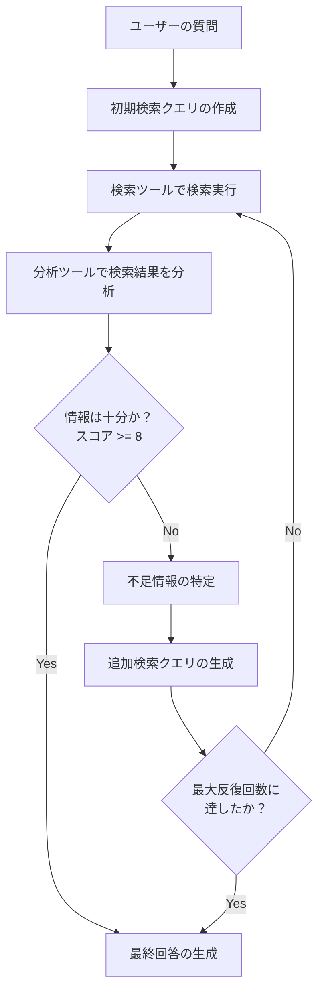

# Deep Research Agent - 反復連鎖検索のフロー

## 概要

Deep Research Agentは、ユーザーの質問に対して反復的な連鎖検索を実行し、情報が十分になるまで検索と分析を繰り返すエージェントです。このドキュメントでは、エージェントの動作フローと実装の詳細を説明します。

## 基本フロー



## 詳細フロー

1. **ユーザーの質問受付**
   - APIエンドポイント `/api/mastra` がユーザーからのクエリを受け取る
   - クエリはDeep Research Agentに転送される

2. **初期検索の実行**
   - ユーザーの質問から初期検索クエリを作成
   - 検索ツール（`searchTool`）を使用して検索を実行
   - 検索結果は構造化されたデータとして返される

3. **検索結果の分析**
   - 分析ツール（`analysisTool`）が検索結果を分析
   - 情報の十分さを10点満点でスコアリング
   - 不足している情報の側面を特定（定義、事例、市場影響、技術詳細、将来展望など）

4. **情報の十分さの評価**
   - スコアが8点以上：情報が十分と判断
   - スコアが8点未満：情報が不十分と判断

5. **追加検索の実行（情報が不十分な場合）**
   - 不足情報に基づいて追加の検索クエリを生成
   - 検索ツールを使用して追加検索を実行
   - 検索結果を再度分析

6. **反復プロセスの終了条件**
   - 情報が十分（スコア >= 8）になった場合
   - 最大反復回数（10回）に達した場合

7. **最終回答の生成**
   - すべての検索結果を統合
   - 包括的な回答を生成
   - 使用した検索クエリ、参考URLなどのメタデータを含める

## コンポーネント構成

### 1. Deep Research Agent

```typescript
// lib/mastra/agents/deep-research-agent.ts
export const deepResearchAgent = new Agent({
  name: "Deep Research Agent",
  instructions: `...`,
  model: openai("gpt-4o"),
  tools: {
    searchTool,
    analysisTool,
  },
});
```

### 2. 検索ツール

```typescript
// lib/mastra/tools/search-tool.ts
export const searchTool = createTool({
  id: "Web Search",
  inputSchema: z.object({
    query: z.string().describe("検索クエリ"),
  }),
  description: "ウェブ検索を実行して情報を取得します",
  execute: async ({ context: { query } }) => {
    // 検索実行ロジック
    // ...
  },
});
```

### 3. 分析ツール

```typescript
// lib/mastra/tools/analysis-tool.ts
export const analysisTool = createTool({
  id: "Search Results Analysis",
  inputSchema: z.object({
    query: z.string().describe("元の検索クエリ"),
    results: z.array(z.object({
      title: z.string(),
      snippet: z.string(),
      url: z.string(),
    })).describe("検索結果"),
    iteration: z.number().optional().describe("現在の検索反復回数"),
    maxIterations: z.number().optional().describe("最大反復回数"),
  }),
  description: "検索結果を分析し、情報の十分さを評価します",
  execute: async ({ context: { query, results, iteration = 1, maxIterations = 10 } }) => {
    // 分析ロジック
    // ...
  },
});
```

### 4. APIルート

```typescript
// app/api/mastra/route.ts
export async function POST(request: Request) {
  // リクエスト処理
  const { query, mode = 'agent' } = body;
  
  // エージェント実行
  const response = await mastra.getAgent('deepResearchAgent').generate(messages, {
    onToolCall: (toolCall) => {
      // ツール実行ログ
    },
    onToolResult: (toolCall, result) => {
      // ツール結果ログ
    }
  });
  
  // レスポンス返却
  return NextResponse.json({
    result: response.text,
    agent: 'Deep Research Agent',
  });
}
```

## 情報の十分さ評価基準

分析ツールは以下の基準で検索結果を評価します（10点満点）：

1. **結果の数**（0-2点）：検索結果の数に基づく評価
2. **内容の関連性**（0-2点）：検索クエリと検索結果の関連性
3. **情報源の多様性**（0-2点）：異なるドメインからの情報の多様さ
4. **詳細度**（0-2点）：スニペットの長さと詳細さ
5. **側面のカバレッジ**（0-2点）：主要な側面（定義、例、事例など）のカバー率

## 不足情報の特定

分析ツールは以下の主要な側面について、検索結果に含まれているかを評価します：

1. **定義と基本概念**：定義、基本的な概念説明
2. **具体的な事例**：実例、ケーススタディ
3. **市場への影響**：経済効果、市場インパクト
4. **技術的詳細**：仕組み、メカニズム、実装方法
5. **将来の展望**：トレンド、予測、今後の発展

## 反復検索の特徴

- 各反復で1つのクエリのみを実行し、段階的に情報を収集
- 検索結果は毎回分析され、10点満点でスコアリング
- スコアが8点以上になった時点で検索を終了し、回答を生成
- 最大10回まで検索を繰り返すが、十分な情報が得られた時点で早期終了
