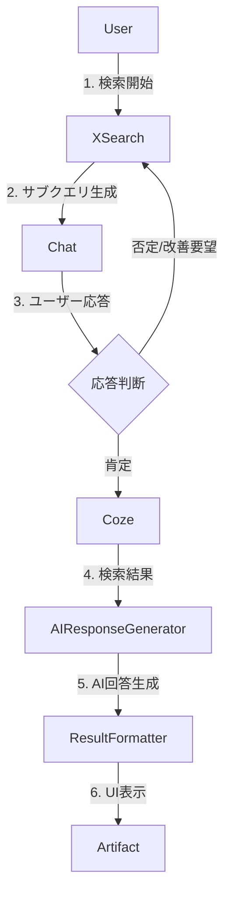

# X検索フロー要件定義

## 1. 検索開始フロー

### 1.1 ユーザーインタラクション
- `components/multimodal-input.tsx`
  - `PureXSearchButton` コンポーネントがクリックされる
  - `handleXSearchClick` 関数が実行される
  - 入力モードがX検索モードに切り替わる

### 1.2 検索実行トリガー
- `components/multimodal-input.tsx`
  - `handleSubmit` 関数内でX検索モードを判定
  - `handleXSearch` 関数を呼び出し

## 2. X検索処理フロー

### 2.1 サブクエリ生成フェーズ
- `lib/ai/x-search/feedback.ts`
  - `generateXSearchSubqueries`関数が実行される
  - 初回質問時のみVercel AI SDKの`streamText`を使用
  - `myProvider.languageModel('chat-model-small')`で指定されたモデルを使用

  - **初回質問時の処理**
    - トピックの具体化（分野、文脈、キーワード）
    - 情報の深さ（概要か詳細か、事実か意見か）
    - 時間的範囲（いつからいつまでか）
    - ユーザーフレンドリーな質問形式
      - 箇条書きで3つの具体的な選択肢を提示
      - インデントによる見やすい表示
      - 現在時刻を考慮した動的な例示
    - ストリーミング処理
      - `smoothStream({ chunking: 'word' })`で単語単位のストリーミング
      - リアルタイムでの結果表示

  - **フィードバック後の処理**
    - `generateCozeResponse`を使用してサブクエリを生成（非ストリーミング）
    - JSON形式でのサブクエリ生成（6～10個）
    - 言語指定に基づくクエリ生成
      - 日本語 (lang:ja): 40% → min_faves:100
      - 英語 (lang:en): 30% → min_faves:500
      - 中国語 (lang:zh): 30% → min_faves:300
    - キーワードの言語変換・選択
      - クエリのlangに合わせた言語表記
    - 期間指定の自動追加
      - 「最新の～」「最近の～」→ 1週間分
      - 具体的な日付指定の反映
    - 生成後の処理
      - JSONとしてパース
      - 検索実行フェーズへの移行
      - エラー時は適切なエラーメッセージを表示

  - **状態管理**
    - `XSearchState`インターフェースで状態を管理
      - stage: 現在の処理段階（'subquery_generation' | 'search_execution'）
      - subqueries: 生成されたサブクエリ
      - previousQueries: 以前の質問履歴
    - X検索モードの状態管理
      - `isXSearchEnabled`: X検索の有効/無効状態を管理
      - ボタンのトグル機能で切り替え可能
      - 回答生成後も状態を維持（明示的な無効化まで継続）

  - **フロー制御**
    - 初回質問時
      - ユーザーの意図を確認する質問を生成（ストリーミング）
      - ユーザーの回答を待機
    - フィードバック後
      - サブクエリを生成（非ストリーミング）
      - 自動的に検索実行フェーズへ移行
      - エラー時は適切なエラーハンドリング

### 2.2 検索実行フェーズ
- `lib/ai/coze/coze.ts`
  - 承認されたサブクエリを使用
  - `executeCozeQueries`関数を実行
  - X検索の実行とデータの収集
  - 進捗状況をストリーミングで表示

### 2.3 AI回答生成フェーズ
- `lib/ai/x-search/index.ts`
  - Cozeの検索結果を受け取る
  - 検索結果を元にAIが回答を生成
    - 検索結果の要約
    - 重要なポイントの抽出
    - ユーザーの質問への具体的な回答
  - 生成された回答をストリーミングで表示

### 2.4 結果の整形
- `lib/ai/x-search/index.ts`
  - AI回答と検索結果を組み合わせて整形
  - 参照元の情報を付加
  - ストリーミングレスポンスを生成

### 2.5 UIへの反映
- `components/artifact.tsx`
  - `XSearchResult`コンポーネントで結果を表示
    - AI回答の表示
    - 参照元の表示
    - インタラクティブな検索結果の参照UI

## 3. 状態管理

### 3.1 X検索の状態
```typescript
interface XSearchState {
  stage: 'subquery_generation' | 'search_execution' | 'response_generation';
  subqueries?: string[];
  searchResults?: XSearchResult[];
  userQuery?: string;
  previousQueries?: string[];  // 追加
  isXSearchEnabled?: boolean;  // 追加
}
```

### 3.2 検索オプション
```typescript
interface XSearchOptions extends ChatRequestOptions {
  isXSearch: boolean;
  xSearchState?: XSearchState;
  userId?: string;
}
```

### 3.3 検索レスポンス
```typescript
interface XSearchResponse {
  role: 'assistant';
  content: string;
  id: string;
  createdAt?: Date;
  xSearchState?: XSearchState;
  references?: XSearchResult[];  // 参照情報を追加
}
```

## 4. エラーハンドリング

### 4.1 エラー発生ポイント
- サブクエリ生成エラー
- 検索実行エラー
- ストリーミング処理エラー

### 4.2 エラー処理
- エラーメッセージのストリーミング
- 状態のリセット
- リトライオプションの提供

## 5. データフロー図



## 6. ファイル間の依存関係

```typescript
// components/multimodal-input.tsx
import { handleXSearch } from '../lib/ai/x-search';
import { XSearchState } from '../types/x-search';

// lib/ai/x-search/index.ts
import { generateSubqueries } from './subquery-generator';
import { executeCozeQueries } from '../coze/coze';
import { generateAIResponse } from './ai-response-generator';
import { formatResults } from './result-formatter';
import { analyzeUserResponse } from './response-analyzer';  // 追加

// lib/ai/x-search/response-analyzer.ts
export interface ResponseAnalysis {
  isPositive: boolean;
  feedback?: string;
}

export function analyzeUserResponse(response: string): ResponseAnalysis {
  // ユーザーの応答を分析
  // - 肯定的な応答かどうか
  // - フィードバックの抽出
}

## 7. 実装ファイル構成

### 7.1 既存ファイル
- `lib/ai/x-search/index.ts`
  - X検索のメインロジック
  - 各フェーズの制御と状態管理

- `lib/ai/x-search/subquery-generator.ts`
  - サブクエリの生成
  - ストリーミングレスポンス

- `lib/ai/coze/coze.ts`
  - Coze APIとの通信
  - 検索実行と結果取得

### 7.2 新規ファイル
- `lib/ai/x-search/_types.ts`
  ```typescript
  // X検索の型定義
  export interface XSearchState {
    stage: 'subquery_generation' | 'search_execution' | 'response_generation';
    subqueries?: string[];
    searchResults?: XSearchResult[];
  }

  export interface XSearchResult {
    content: string;
    metadata: {
      sourceUrl: string;
      author?: string;
      timestamp?: string;
    };
  }
  ```

- `lib/ai/x-search/ai-response-generator.ts`
  ```typescript
  // AI回答生成
  import { Message } from 'ai';
  import { XSearchResult } from './_types';

  export async function generateAIResponse(
    searchResults: XSearchResult[],
    userQuery: string
  ): Promise<Message> {
    // AIモデルを使用して検索結果から回答を生成
    // ストリーミングレスポンスを返却
  }
  ```

- `lib/ai/x-search/result-formatter.ts`
  ```typescript
  // 結果の整形
  import { XSearchResult } from './_types';

  export interface FormattedResult {
    aiResponse: string;
    references: XSearchResult[];
  }

  export function formatResults(
    aiResponse: string,
    searchResults: XSearchResult[]
  ): FormattedResult {
    // AI回答と検索結果を組み合わせて整形
    // 参照情報を付加
  }
  ```

- `lib/ai/x-search/response-analyzer.ts`
  ```typescript
  // ユーザー応答の分析
  export interface ResponseAnalysis {
    isPositive: boolean;
    feedback?: string;
  }

  export function analyzeUserResponse(response: string): ResponseAnalysis {
    // ユーザーの応答を分析
    // - 肯定的な応答かどうか
    // - フィードバックの抽出
  }
  ```

## TODO
- <font color="red">データベースを変更する</font>
